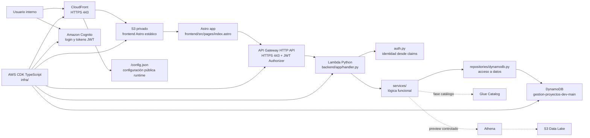

# Gestión de Proyectos

Base de trabajo para una plataforma interna de gestión de proyectos, tareas, accesos funcionales y catálogo de Data Lake sobre AWS.

La aplicación debe mantenerse simple, clara y rápida. No busca replicar Jira ni convertirse en una herramienta pesada de seguimiento. Debe servir como base modular para equipos internos que necesitan coordinar proyectos, tareas, datos disponibles y permisos de acceso.

## Proposito

- Gestionar proyectos internos y sus tareas.
- Controlar accesos por usuario, modulo y proyecto.
- Mostrar solo los módulos habilitados para cada usuario.
- Integrar un catálogo funcional sobre Glue Catalog, DynamoDB y Athena.
- Mantener auditoría de cambios relevantes.

## Arquitectura esperada

- Frontend: Astro.
- Hosting: CloudFront sobre S3 privado.
- Autenticacion: Amazon Cognito.
- API: API Gateway con Lambda Python.
- Datos operativos: DynamoDB.
- Catálogo técnico: Glue Catalog.
- Consultas controladas: Athena.
- Data Lake: S3.

## Diagrama de arquitectura

La plataforma no usa MVC clásico. La construcción actual usa una arquitectura serverless por capas: interfaz Astro, adaptador HTTP en Lambda, servicios de dominio, repositorios AWS e infraestructura CDK.



Detalle de arquitectura, capas, puertos y flujo local/publicación: `docs/17_desarrollo_local_publicacion.md`.

## Documentacion

El contexto detallado vive en `docs/`:

- `docs/00_contexto_general.md`: objetivo, alcance y principios.
- `docs/01_arquitectura_aws.md`: infraestructura y flujos tecnicos.
- `docs/02_modulos_funcionales.md`: módulos esperados.
- `docs/03_seguridad_accesos.md`: autenticacion, autorizacion y permisos.
- `docs/04_modelo_dynamodb.md`: modelo operacional.
- `docs/05_api_backend.md`: estructura y contratos de API.
- `docs/06_frontend_ux.md`: experiencia de usuario.
- `docs/07_catalogo_datalake.md`: catalogo Glue, contexto funcional y Athena.
- `docs/08_proyectos_tareas.md`: reglas de proyectos y tareas.
- `docs/09_admin_accesos.md`: administracion de usuarios y accesos.
- `docs/10_integraciones_aws.md`: integraciones AWS.
- `docs/11_fases_implementacion.md`: roadmap inicial.
- `docs/12_guardrails.md`: reglas que no deben romperse.
- `docs/13_backlog_inicial.md`: tareas iniciales de construccion.
- `docs/14_permisos_aws_actuales.md`: perfil AWS validado, permisos encontrados y limitantes.
- `docs/15_estado_implementacion.md`: estado actual del primer corte, comandos y pendientes.
- `docs/16_credenciales_aws_sso.md`: uso del perfil SSO para este proyecto.
- `docs/17_desarrollo_local_publicacion.md`: arquitectura por capas, puertos, desarrollo local y publicación.

## Estado actual

Este directorio contiene el primer corte técnico desplegado en `dev`: monorepo con frontend Astro, backend Lambda Python e infraestructura CDK TypeScript sobre la cuenta `186281981036`.

- Frontend: `https://d269paz1z7q1g0.cloudfront.net/`
- API: `https://63ibnl13da.execute-api.us-east-1.amazonaws.com/`
- Usuario inicial Cognito: `usr041100@banrural.com.gt` con cambio de contraseña inicial requerido.

## Comandos principales

```bash
npm install
npm run check
npm run dev
npm run infra:deploy
```

Desarrollo local:

- Frontend Astro: `http://127.0.0.1:4321/`.
- Backend: no expone puerto local por defecto; se ejecuta como Lambda en AWS.
- API publicada dev: `https://63ibnl13da.execute-api.us-east-1.amazonaws.com/`.
- Frontend publicado dev: `https://d269paz1z7q1g0.cloudfront.net/`.

Antes de cualquier acción AWS:

```bash
aws sts get-caller-identity --profile gestion-proyectos-dev --region us-east-1 --no-cli-pager
```

Después de desplegar infraestructura, publicar el frontend estático:

```bash
npm run build -w frontend
aws s3 sync frontend/dist/ s3://gestion-proyectos-dev-frontend-186281981036/ --delete --profile gestion-proyectos-dev --region us-east-1
aws s3 sync /private/tmp/gestion-proyectos-public-config/ s3://gestion-proyectos-dev-frontend-186281981036/ --cache-control no-store --profile gestion-proyectos-dev --region us-east-1
aws cloudfront create-invalidation --distribution-id E2K3CA110228B1 --paths "/*" --profile gestion-proyectos-dev
```
