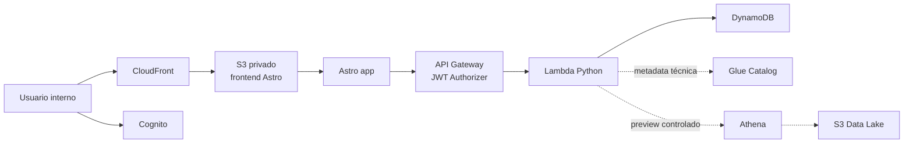

# Arquitectura AWS

## Arquitectura base

La estructura no es MVC clásico. El patrón actual es serverless por capas, con
**módulos enchufables** tanto en backend como en frontend:

- Capa de presentación: Astro en `frontend/`. El shell vive en `scripts/app.ts` y cada
  módulo de UI en `scripts/modules/` (`home`, `workspace`, `catalog`, `admin`), creado
  por inyección de dependencias (`createXModule(ctx)`).
- Capa de entrada HTTP: API Gateway y `backend/app/handler.py` (delgado) + `core/router.py`
  (router por registro). Cada módulo declara sus rutas en `modules/<x>_routes.py` y se
  autodescubre; agregar un módulo no toca el núcleo.
- Capa de identidad: Cognito, JWT Authorizer y `backend/app/auth.py`. Autorización
  declarativa en `core/guards.py` (`ensure_module_access`, `ensure_admin`).
- Capa funcional: servicios en `backend/app/services/`.
- Capa de datos: **un repositorio por dominio** en `backend/app/repositories/`
  (`users`, `workspace`, `catalog`, `home`, `glue`) sobre `base.py`; sin god-class.
- Capa de infraestructura: CDK TypeScript en `infra/`.

El detalle operativo de puertos, desarrollo local y publicación está en `docs/17_desarrollo_local_publicacion.md`.

## Stack tecnológico

Lenguajes, frameworks y herramientas concretas por capa:

| Capa | Lenguaje | Framework / herramientas | Librerías clave | Dónde |
| --- | --- | --- | --- | --- |
| Frontend (UI) | **TypeScript** | **Astro** (genera HTML + JS estático). UI imperativa propia: shell + módulos por inyección de dependencias (`createXModule(ctx)`). **Sin React/Vue/Angular**. | AWS SDK v3 (`@aws-sdk/client-cognito-identity-provider`), Chart.js (dashboard), D3 (grafo del catálogo) | `frontend/` |
| Estilos | **CSS** plano | Sin Tailwind/Sass | — | `frontend/src/styles/app.css` |
| Backend (API) | **Python 3.12** | **Sin framework web** (no Flask/FastAPI/Django). Router propio por registro (`core/router.py`) + módulos autodescubiertos. | `boto3` (AWS SDK) | `backend/app/` |
| Persistencia | — | **DynamoDB single-table**, sin ORM | `boto3` resource | `backend/app/repositories/` |
| Infraestructura | **TypeScript** | **AWS CDK v2** (`aws-cdk-lib`) | — | `infra/` |
| Build / tooling | — | **pnpm** (workspace), **Vite/esbuild** (vía Astro) | — | raíz · `frontend/` |

**Qué NO se usa** (para evitar suposiciones comunes):

- Frontend: ningún framework SPA (React, Vue, Angular), ni JSX, ni store tipo Redux. "Navegar" es mutar `state.activeModule` y re-renderizar; no hay router de cliente.
- Backend: ningún framework web Python ni ORM. La autorización es código propio en `core/guards.py`.
- Sin SQL libre desde el frontend (Athena es preview controlado; ver `docs/00_contexto_general.md`).

## Servicios utilizados

- Astro: frontend web.
- S3 privado: almacenamiento del build estático.
- CloudFront: distribución del frontend.
- Cognito: autenticación.
- API Gateway: entrada HTTP segura para backend.
- Lambda Python: lógica de negocio.
- DynamoDB: datos operativos, autorización funcional y contexto.
- Glue Catalog: metadata técnica de bases, tablas y columnas.
- Athena: preview y consultas controladas.
- S3 Data Lake: datos fuente.
- CloudWatch: logs y métricas.
- IAM: permisos entre servicios.
- Lake Formation: control adicional opcional sobre datos.

## Flujo frontend a backend

1. El usuario abre la aplicación desde CloudFront.
2. El frontend valida sesión con Cognito.
3. El frontend envía el JWT en cada llamada a API Gateway.
4. API Gateway valida el token con JWT Authorizer.
5. Lambda recibe identidad validada.
6. Lambda consulta DynamoDB para permisos funcionales.
7. Lambda ejecuta la acción permitida y devuelve respuesta estándar.

## Flujo de inicio de sesión

1. El usuario inicia sesión con Cognito.
2. Cognito emite tokens.
3. El frontend conserva la sesión según la estrategia definida.
4. El frontend llama `GET /api/me`.
5. Backend devuelve perfil funcional, módulos habilitados y permisos.

## Flujo API

Todas las operaciones deben pasar por API Gateway y Lambda. El frontend no debe acceder directamente a DynamoDB, Glue, Athena ni S3 Data Lake.

## Flujo local a publicación

1. Desarrollar frontend con Astro en `http://127.0.0.1:4321/`.
2. Validar frontend, Python y CDK con `npm run check`.
3. Publicar cambios de backend con zip de `backend/app` hacia Lambda cuando solo cambia código Python.
4. Publicar frontend con `npm run build -w frontend`, `aws s3 sync` e invalidación CloudFront.
5. Usar `npm run infra:deploy` cuando cambien recursos AWS o configuración estructural.

## Flujo consulta Data Lake

1. Frontend solicita catálogo o preview.
2. Lambda valida permisos funcionales en DynamoDB.
3. Lambda obtiene metadata técnica desde Glue Catalog.
4. Lambda combina metadata técnica con contexto funcional guardado en DynamoDB.
5. Para preview, Lambda ejecuta consulta Athena controlada.
6. Lambda devuelve datos limitados y seguros.

## Ambientes

- `dev`: desarrollo y pruebas locales.
- `test`: validación integrada.
- `prod`: uso real.

Cada ambiente debe tener recursos, variables y permisos separados.
