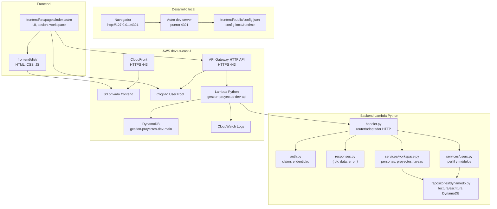

# Desarrollo local y publicación

## Resumen

Este proyecto usa una arquitectura serverless por capas, no MVC clásico.

La separación principal es:

- `frontend/`: interfaz Astro estática.
- `backend/`: Lambda Python con adaptador HTTP, servicios y repositorios.
- `infra/`: AWS CDK TypeScript para definir infraestructura.
- `docs/`: contexto funcional, técnico y operativo.

## Diagrama de componentes



## Capas de backend

La Lambda se organiza por capas simples:

- `handler.py`: recibe el evento de API Gateway, resuelve ruta/método y llama servicios.
- `auth.py`: extrae identidad desde claims validados por API Gateway JWT Authorizer.
- `services/`: contiene reglas funcionales y validaciones de negocio.
- `repositories/`: encapsula DynamoDB y evita que la lógica funcional dependa de llamadas directas de bajo nivel.
- `responses.py`: estandariza respuestas `{ ok, data, error }`.

Regla: el frontend nunca accede directo a DynamoDB, Glue, Athena ni S3 Data Lake.

## Puertos y endpoints

| Uso | Valor |
| --- | --- |
| Frontend local Astro | `http://127.0.0.1:4321/` |
| Preview local Astro | `http://127.0.0.1:4321/` si el puerto está libre |
| Backend local | No expone puerto local por defecto |
| Frontend dev publicado | `https://d269paz1z7q1g0.cloudfront.net/` |
| API dev publicada | `https://63ibnl13da.execute-api.us-east-1.amazonaws.com/` |
| CloudFront/API Gateway | HTTPS `443` |
| Región AWS dev | `us-east-1` |
| Perfil AWS | `gestion-proyectos-dev` |

Si `4321` está ocupado, Astro puede usar otro puerto. En ese caso revisar que Cognito tenga callback/logout permitido para la URL local usada.

## Configuración runtime

El frontend lee `/config.json` en runtime.

El archivo versionado `frontend/public/config.json` se mantiene como plantilla local sin secretos:

```json
{
  "environment": "local",
  "region": "us-east-1",
  "apiBaseUrl": "",
  "cognitoUserPoolId": "",
  "cognitoClientId": "",
  "cognitoDomain": ""
}
```

Para pruebas locales contra AWS dev, se pueden usar los valores públicos del ambiente:

```json
{
  "environment": "dev",
  "region": "us-east-1",
  "apiBaseUrl": "https://63ibnl13da.execute-api.us-east-1.amazonaws.com/",
  "cognitoUserPoolId": "us-east-1_lN4JYAVlQ",
  "cognitoClientId": "uhquk1hakj8nifgi3j6hv8dbh",
  "cognitoDomain": "gestion-proyectos-dev-186281981036"
}
```

No colocar secretos, tokens temporales ni credenciales AWS en `config.json`.

## Desarrollo local

El workspace usa `pnpm` (`pnpm-workspace.yaml`). Instalar dependencias:

```bash
pnpm install
```

Levantar frontend:

```bash
cd frontend
pnpm dev
```

Abrir:

```text
http://127.0.0.1:4321/
```

Validar todo antes de publicar:

```bash
npm run check
```

`npm run check` ejecuta:

- Build y validación de Astro.
- Compilación Python con `py_compile`.
- `cdk synth`.

## Validación AWS previa

Antes de acciones AWS relevantes:

```bash
aws sts get-caller-identity --profile gestion-proyectos-dev --region us-east-1 --no-cli-pager
```

Si la sesión SSO expiró:

```bash
aws sso login --sso-session bdr-fed
```

No usar `AWS_ACCESS_KEY_ID`, `AWS_SECRET_ACCESS_KEY` ni `AWS_SESSION_TOKEN` como flujo normal del proyecto.

## Publicación de backend

La infraestructura define la Lambda desde `backend/app`. Para publicar cambios de código backend sin cambiar infraestructura:

```bash
cd backend/app
zip -r /private/tmp/gestion-proyectos-api.zip .
cd ../..
aws lambda update-function-code \
  --function-name gestion-proyectos-dev-api \
  --zip-file fileb:///private/tmp/gestion-proyectos-api.zip \
  --profile gestion-proyectos-dev \
  --region us-east-1 \
  --no-cli-pager
aws lambda wait function-updated \
  --function-name gestion-proyectos-dev-api \
  --profile gestion-proyectos-dev \
  --region us-east-1
```

Validar salud:

```bash
curl -i https://63ibnl13da.execute-api.us-east-1.amazonaws.com/health
```

## Publicación de frontend

### Método recomendado: `scripts/deploy-frontend.sh`

Usar siempre este script. Compila, sincroniza los assets **excluyendo `config.json` y `.DS_Store`**, y **regenera `config.json` desde los outputs reales del stack** (Cognito + API), por lo que no depende de un archivo temporal ni puede dejar a los usuarios fuera:

```bash
./scripts/deploy-frontend.sh                                  # dev (por defecto)
STACK=GestionProyectosProdStack PROFILE=<perfil> ENV_NAME=prod ./scripts/deploy-frontend.sh
```

> ⚠️ **Nunca** correr `aws s3 sync dist/ ... --delete` sin `--exclude config.json`. El `frontend/public/config.json` versionado es un placeholder vacío (`environment: local`); un sync sin exclusión lo sube y borra el `config.json` real de producción → la pantalla de login muestra "Falta completar la configuración de acceso" y nadie puede entrar. El `config.json` real **solo vive en S3**, no en git.

### Flujo manual equivalente (si no se usa el script)

```bash
cd frontend
pnpm build
cp /tmp/config-prod.json dist/config.json
aws s3 sync dist/ s3://gestion-proyectos-dev-frontend-186281981036 \
  --delete \
  --profile gestion-proyectos-dev \
  --exclude config.json --exclude .DS_Store
aws cloudfront create-invalidation \
  --distribution-id E2K3CA110228B1 \
  --paths "/*" \
  --profile gestion-proyectos-dev
```

El `--exclude config.json` evita que el sync sobrescriba o borre el config publicado. Si `/tmp/config-prod.json` no existe, recrearlo con los valores públicos de `dev` documentados en `docs/15_estado_implementacion.md`.

Alternativa para restaurar solo `/config.json` con `no-store`:

```bash
aws s3api put-object \
  --bucket gestion-proyectos-dev-frontend-186281981036 \
  --key config.json \
  --body /tmp/config-prod.json \
  --cache-control no-store \
  --content-type application/json \
  --profile gestion-proyectos-dev \
  --region us-east-1 \
  --no-cli-pager
```

Invalidar CloudFront:

```bash
aws cloudfront create-invalidation \
  --distribution-id E2K3CA110228B1 \
  --paths "/*" \
  --profile gestion-proyectos-dev \
  --no-cli-pager
```

Esperar invalidación:

```bash
aws cloudfront wait invalidation-completed \
  --distribution-id E2K3CA110228B1 \
  --id <INVALIDATION_ID> \
  --profile gestion-proyectos-dev
```

## Verificación publicada

Validar frontend:

```bash
curl -I --http1.1 https://d269paz1z7q1g0.cloudfront.net/
```

Validar config runtime:

```bash
curl -s --http1.1 https://d269paz1z7q1g0.cloudfront.net/config.json
aws s3api head-object \
  --bucket gestion-proyectos-dev-frontend-186281981036 \
  --key config.json \
  --profile gestion-proyectos-dev \
  --region us-east-1 \
  --no-cli-pager
```

Validar API:

```bash
curl -i --http1.1 https://63ibnl13da.execute-api.us-east-1.amazonaws.com/health
```

## Publicación de infraestructura

Usar CDK cuando cambien recursos AWS, rutas, permisos, tablas, Cognito, CloudFront o configuración estructural:

```bash
npm run infra:synth
npm run infra:deploy
```

En este proyecto, algunos cambios operativos se publican con AWS CLI para evitar bloquear avances por problemas del `BucketDeployment` o resolución SSO del CDK CLI. Cuando se use CLI, el CDK debe quedar sincronizado con el estado deseado en `infra/`.

## Reglas operativas

- Mantener textos visibles en español.
- Mantener `docs/` sincronizado con cambios reales.
- Validar permisos en backend, no solo ocultar controles en frontend.
- No publicar buckets S3 como públicos.
- No guardar secretos ni credenciales temporales en el repo.
- Validar STS antes de publicar en AWS.
